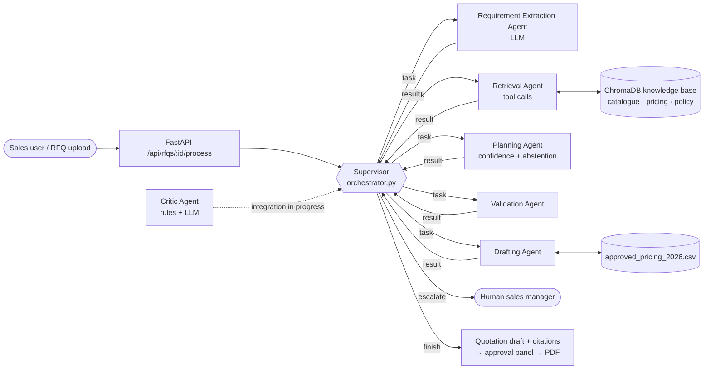

# QuoteGuard AI — Source-Grounded Agentic Quotation Intelligence Platform

**Team:** AXION AI · **Course:** F0003 Agentic AI — CA3 (Multi-Agent AI System)
**Live demo:** _URL added after deployment_ · **License:** MIT

QuoteGuard AI turns a customer's Request for Quotation (RFQ) into a quotation draft that a sales
manager can approve. Every price it quotes is traced to the company's approved price list, and when
something cannot be verified it refuses to guess: it **abstains**, asks the customer a clarification
question, and leaves the decision to a human.

---

## 1. Problem, solution and target user

**Problem.** Small and medium B2B manufacturers and distributors receive RFQs as unstructured
emails, PDFs and documents. Answering one means reading it, finding each product in the catalogue,
checking the requested specification, looking up the approved price and discount, and checking the
customer's payment and delivery terms against company policy. Done by hand this takes hours per
RFQ and invites copy-paste mistakes. A general-purpose chatbot is faster but worse: it will happily
invent a discount or quote a material grade the company does not stock, which is a commercial and
legal liability.

**Solution.** QuoteGuard AI splits the job across specialised agents coordinated by a supervisor.
They extract the requirements, retrieve evidence from the company's own documents, score how well
each line is grounded, draft the quotation, and review the draft before a human sees it. Prices come
only from the approved pricing schedule and carry a citation to the evidence used. Anything that
cannot be grounded — an unstocked grade, a credit period beyond policy — produces a clarification
request and an escalation note instead of a number.

**Target user.** Sales and estimation teams at B2B MSMEs (industrial valves, piping hardware,
fabricated components) who answer many RFQs and need speed without commercial risk. The sales
manager stays in control: nothing is sent until they approve it.

## 2. Why several agents instead of one prompt

One LLM prompt that reads the RFQ, searches, prices and writes the quote has no checkpoint where a
wrong price can be caught, and no way to go back and look again when evidence is weak. Splitting the
work lets each step be checked and, where needed, redone:

- the **supervisor** decides what happens next from what the last agent produced, instead of a fixed order;
- the **critic** reviews the draft independently of the agent that wrote it and can send it back;
- arithmetic and catalogue facts are checked by code, while LLMs are used for reading unstructured
  text and judging policy language — the parts code cannot do.

## 3. Architecture



**Orchestration pattern: supervisor (orchestrator-worker).** A supervisor node, built with
[LangGraph](https://github.com/langchain-ai/langgraph), runs between every agent. Each agent returns
its result to the supervisor, and the supervisor decides which agent acts next. All agents share one
typed state object (`AgentState`, `backend/app/agents/state.py`), and every handoff is recorded as a
message.

**Why this pattern.** Quotation work has a natural order (you cannot price before you know what was
asked), but the *path* through it must change with the RFQ: weak evidence needs another search, an
empty extraction needs a re-read, a failing agent needs a retry or a human. A supervisor keeps that
decision in one place, where it can be guarded and logged. A peer-to-peer design would spread the
routing logic across every agent and make loops harder to bound.

**Why LangGraph.** It gives conditional edges and cycles (needed for re-search and revision loops), a
typed shared state, and a recursion limit, without hiding the agents' own code. CrewAI and AutoGen
were heavier than needed for five tightly-scoped agents.

### How the supervisor decides (`backend/app/agents/orchestrator.py`)

1. `legal_moves()` lists only the moves that make sense from the current state — for example, no
   drafting before extraction, and a re-search only while the retry budget lasts. This is the guardrail.
2. If there is exactly one legal move it is taken (`decided_by: "forced"`).
3. If there are several, the supervisor LLM chooses one and gives a reason (`"llm"`). If no LLM is
   available, or it names a move that is not legal, the first legal move is used (`"policy"`).

Behaviour that depends on what agents produce:

| Situation | Supervisor's response |
|---|---|
| Extraction returns no line items | Re-read the RFQ, or escalate |
| Retrieval returns no evidence | Search again, or let planning abstain |
| Weak evidence for a **stocked** item | One more search before validation |
| Requested grade is **not stocked** (e.g. SS316) | No re-search — searching cannot fix it; go to validation and abstain |
| An agent raises an exception | Record the error, retry, escalate to a human after 3 attempts |
| More than 16 decisions | Stop and escalate (loop guard) |

Every decision is stored in `state.orchestrator_decisions` (`step`, `next`, `reason`, `decided_by`,
`options`) and every handoff in `state.messages` (`from`, `to`, `type: task | result | error | escalation`).

## 4. Agents

| Agent | File | What it does | Uses LLM | Owner |
|---|---|---|---|---|
| Supervisor | `agents/orchestrator.py` | Chooses the next agent, retries, escalates, logs every decision | Yes, at branch points | Vedant |
| Requirement Extraction | `agents/requirement_agent.py` | Turns RFQ text into structured line items and commercial terms | Yes | Samartha |
| Retrieval | `agents/retrieval_agent.py` | Calls `search_catalogue`, `lookup_price`, `get_delivery_policy` over ChromaDB | No (tool calls) | Atharva |
| Planning | `agents/planning_agent.py` | Scores grounding confidence per line, flags unstocked grades, decides abstention | No | Samartha |
| Validation | `agents/validation_agent.py` | Marks each line verified or abstained against the threshold | No | Samartha |
| Drafting | `agents/drafting_agent.py` | Prices lines from the approved CSV with citations, or writes clarification questions | No | Tej |
| Critic | `agents/critic_agent.py` | Reviews the draft: rule checks + LLM policy review; returns approve / revise | Yes | Vedant |

The **critic** (`run_critic_agent`) is implemented and tested; wiring it into the supervisor so that
"revise" sends the draft back is in progress. It works in two layers:

- **Rules** (cannot be overridden by the LLM): every RFQ item is on the draft, quantities match the RFQ,
  each unit price equals the approved price after the bulk-discount schedule, totals include 18% GST,
  abstained lines carry no price, and every price cites a chunk that retrieval actually returned.
- **LLM review**: looks for customer terms that conflict with company policy. An LLM-raised error only
  counts if it quotes the conflicting RFQ and policy sentences, both quotes exist in the real texts, a
  second narrow LLM question confirms the conflict, and no clarification question already raises it.
  Otherwise it is kept as a warning.

## 5. Grounding and abstention

- **Confidence per line item** (`backend/app/utils/confidence.py`):
  - if the requested material grade is not in the approved pricing schedule → **0.40**;
  - otherwise `min(1.0, S_max + B)`, where `S_max` is the highest similarity among retrieved chunks and
    `B = 0.10` when the product name appears verbatim in a retrieved chunk.
- **Abstention** (`planning_agent.py`): if any line scores below `GROUNDING_THRESHOLD` (default 0.80)
  or has an unstocked grade, the RFQ is `ABSTAINED` and no price is generated for those lines.
- **Retrieval** keeps the top-k chunks and marks each with `is_grounded = score >= threshold`; the
  confidence score, not a hard filter, decides what is trusted.
- **Prices** are never produced by an LLM. Drafting reads them from
  `data/pricing/approved_pricing_2026.csv` and applies its bulk-discount rule; the critic re-checks them.
  The citation attached to a price points at the highest-scoring retrieved chunk, which may be the
  catalogue rather than the pricing file.

## 6. Input and output

**Input** — an RFQ as plain text, or an uploaded `.pdf`, `.docx`, `.csv`, `.txt` or `.md` file
(`POST /api/rfqs`, `POST /api/rfqs/upload`), then `POST /api/rfqs/{id}/process`. Samples:
`data/rfqs/demo_rfq_1_complete.txt` (fully quotable) and `data/rfqs/demo_rfq_2_ambiguous.txt`
(SS316 grade, 90-day credit, 3-day doorstep delivery).

**Output** — a quotation draft with status `PENDING_APPROVAL` or `CLARIFICATION_REQUIRED`, line items
with confidence and citations, totals, clarification questions and escalation notes, plus the agent
run log. Abridged real output for demo RFQ 1 (local run, llama3):

```json
{
  "status": "PENDING_APPROVAL",
  "grounded_status": "GROUNDED",
  "line_items": [
    {"product_code": "IV-200", "material_grade": "SS304", "quantity": 20,
     "unit_price": 4500.0, "total_price": 90000.0, "status": "verified",
     "citations": [{"field_name": "unit_price", "source_filename": "product_catalog_2026.md", "...": "..."}]},
    {"product_code": "PV-100", "material_grade": "SS304", "quantity": 15,
     "unit_price": 2800.0, "total_price": 42000.0, "status": "verified"}
  ],
  "subtotal": 132000.0, "tax_amount": 23760.0, "total_amount": 155760.0
}
```

## 7. Tech stack

| Layer | Technology |
|---|---|
| Agents | Python, LangGraph, Pydantic v2 shared state |
| LLM | Any OpenAI-compatible endpoint (OpenAI, Groq, Gemini, or local Ollama) via `openai` client |
| Retrieval | ChromaDB, Sentence-Transformers `all-MiniLM-L6-v2` |
| Backend | FastAPI, SQLAlchemy + SQLite, JWT auth (PyJWT, bcrypt), optional Google sign-in, ReportLab PDFs |
| Frontend | React 18, TypeScript, Vite 5, React Router, Recharts, Lucide icons |
| Tests | pytest |

## 8. Repository structure

```
backend/
  app/
    agents/      orchestrator.py (supervisor), critic_agent.py, requirement/retrieval/
                 planning/validation/drafting agents, state.py, workflow.py (entry point)
    tools/       catalogue, pricing, policy and search tools; pricing_catalog.py (CSV loader)
    rag/         chunking, embeddings, ChromaDB vector store, retriever, ingestion
    llm/         OpenAI-compatible client, prompts, JSON parsing
    api/         FastAPI routes: auth, rfqs, quotations, knowledge, dashboard, evaluation
    services/    business logic behind the routes
    db/  schemas/  core/  utils/
  tests/         pytest suite
frontend/src/    pages, components, api clients, auth context
data/            company catalogue, approved pricing CSV, policies, sample RFQs, evaluation set
docs/            architecture, agent workflow, API, database, evaluation, demo script
```

## 9. Running it

### Backend

```bash
cd backend
python -m venv .venv
source .venv/bin/activate          # Windows: .venv\Scripts\activate
pip install -r requirements.txt
cp .env.example .env               # then edit .env (see below)
uvicorn app.main:app --reload --port 8000
```

API docs: <http://localhost:8000/docs>. On first start the server loads the catalogue, pricing schedule
and policy document into the knowledge base and creates a demo login:
`sales.manager@vertexind.com` / `quoteguard123` (change `DEFAULT_ADMIN_PASSWORD` outside development).

### Frontend

```bash
cd frontend
npm install
npm run dev
```

Open <http://localhost:5173>. The dev server proxies `/api` to the backend on port 8000.

### LLM configuration (`backend/.env`)

| Variable | Meaning |
|---|---|
| `DEMO_MODE` | `true` = no LLM calls; extraction returns canned output for the two sample RFQs. Use `false` for real agent behaviour. |
| `OPENAI_API_KEY`, `OPENAI_BASE_URL`, `OPENAI_MODEL` | Any OpenAI-compatible provider. Local Ollama: `ollama`, `http://localhost:11434/v1`, `llama3`. |
| `ORCHESTRATOR_USE_LLM` | `true` (default) lets the supervisor LLM choose between legal moves. |
| `GROUNDING_THRESHOLD` | Minimum confidence for a line to be quoted (default `0.80`). |

Demo mode exists so the UI can be shown without a key. It is **not** used for execution traces — those
come from runs with `DEMO_MODE=false`.

## 10. Tests

```bash
cd backend
python -m pytest -q
```

7 test modules, 35 tests: health, chunking, retrieval, abstention, the end-to-end workflow, supervisor
routing (`test_orchestrator.py` — retries, escalation, re-extraction, re-search rules, LLM-vs-policy
choice) and the critic (`test_critic.py` — price, discount, quantity, GST, citation checks and the
safeguards on LLM findings). Agent tests use fake agents or a fake LLM, so they need no API key.

## 11. Evaluation

`POST /api/evaluation/run` (or the Evaluation page) runs every case in
`data/evaluation/test_dataset.json` through the agents and records grounding rate, hallucination rate,
abstention accuracy, extraction accuracy, retrieval precision, average latency and estimated API cost.
The figures are computed on each run, not fixed. The benchmark currently has two cases (one quotable,
one that must abstain) and is being extended.

## 12. Known limitations

- The critic is not yet part of the supervisor's loop (in progress).
- Retrieval, planning, validation and drafting are deterministic today; making retrieval choose its own
  tools and queries, and drafting revise on critic feedback, is in progress.
- The frontend Docker image serves on port 80 while `docker-compose.yml` maps 5173; use the local setup
  above until the Docker setup is fixed.
- The knowledge base is loaded when the server starts; scripts that skip startup see an empty store.

## 13. Team

| Member | Area |
|---|---|
| Samartha Shrestha | Platform (backend, frontend, RAG, auth, evaluation), extraction agent |
| Vedant Nair | Supervisor orchestrator, critic agent, deployment |
| Atharva Kulkarni | Retrieval agent, design document, I/O definitions |
| Tej Narayan Sah | Drafting agent, execution trace, synopsis, demo video |

QuoteGuard AI is an academic prototype built on fictional company data ("Vertex Industrial Supplies
Pvt. Ltd."). Released under the MIT License.
