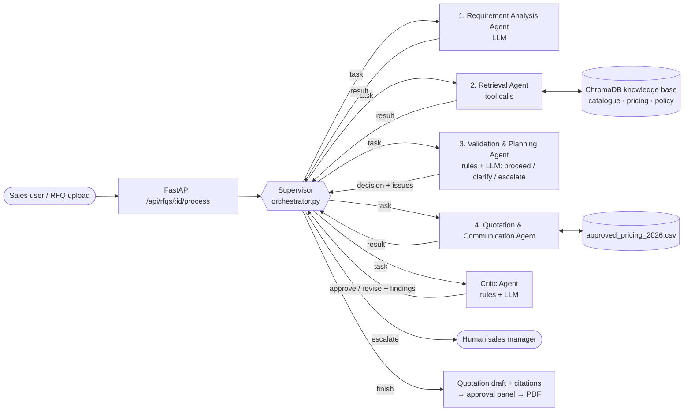

# QuoteGuard AI — Source-Grounded Agentic Quotation Intelligence Platform

**Team:** AXION AI · **Course:** F0003 Agentic AI — CA3 (Multi-Agent AI System)
**Live demo:** _URL added after deployment_ · **License:** MIT

QuoteGuard AI turns a customer's Request for Quotation (RFQ) into a quotation draft that a sales
manager can approve. Every price it quotes is traced to the company's approved price list, and when
something cannot be verified it refuses to guess: it **abstains**, asks the customer a clarification
question, and leaves the decision to a human.

---

## 1. Problem, solution and target user

**Problem.** Small and medium B2B manufacturers and distributors receive RFQs as unstructured
emails, PDFs and documents. Answering one means reading it, finding each product in the catalogue,
checking the requested specification, looking up the approved price and discount, and checking the
customer's payment and delivery terms against company policy. Done by hand this takes hours per
RFQ and invites copy-paste mistakes. A general-purpose chatbot is faster but worse: it will happily
invent a discount or quote a material grade the company does not stock, which is a commercial and
legal liability.

**Solution.** QuoteGuard AI splits the job across specialised agents coordinated by a supervisor.
They extract the requirements, retrieve evidence from the company's own documents, score how well
each line is grounded, draft the quotation, and review the draft before a human sees it. Prices come
only from the approved pricing schedule and carry a citation to the evidence used. Anything that
cannot be grounded — an unstocked grade, a credit period beyond policy — produces a clarification
request and an escalation note instead of a number.

**Target user.** Sales and estimation teams at B2B MSMEs (industrial valves, piping hardware,
fabricated components) who answer many RFQs and need speed without commercial risk. The sales
manager stays in control: nothing is sent until they approve it.

## 2. Why several agents instead of one prompt

One LLM prompt that reads the RFQ, searches, prices and writes the quote has no checkpoint where a
wrong price can be caught, and no way to go back and look again when evidence is weak. Splitting the
work lets each step be checked and, where needed, redone:

- the **supervisor** decides what happens next from what the last agent produced, instead of a fixed order;
- the **critic** reviews the draft independently of the agent that wrote it and can send it back;
- arithmetic and catalogue facts are checked by code, while LLMs are used for reading unstructured
  text and judging policy language — the parts code cannot do.

## 3. Architecture



After drafting, the **critic** reviews the draft. *Approve* finishes the run. *Revise* goes back to the
agent the critic names (drafting, or retrieval when evidence is missing), with the critic's findings as
the task, at most twice. If a revision changes nothing, or only a person can resolve the problem, the
supervisor escalates to the sales manager with the critic's findings in the escalation note.

**Orchestration pattern: supervisor (orchestrator-worker).** A supervisor node, built with
[LangGraph](https://github.com/langchain-ai/langgraph), runs between every agent. Each agent returns
its result to the supervisor, and the supervisor decides which agent acts next. All agents share one
typed state object (`AgentState`, `backend/app/agents/state.py`), and every handoff is recorded as a
message.

**Why this pattern.** Quotation work has a natural order (you cannot price before you know what was
asked), but the *path* through it must change with the RFQ: weak evidence needs another search, an
empty extraction needs a re-read, a failing agent needs a retry or a human. A supervisor keeps that
decision in one place, where it can be guarded and logged. A peer-to-peer design would spread the
routing logic across every agent and make loops harder to bound.

**Why LangGraph.** It gives conditional edges and cycles (needed for re-search and revision loops), a
typed shared state, and a recursion limit, without hiding the agents' own code. CrewAI and AutoGen
were heavier than needed for five tightly-scoped agents.

### How the supervisor decides (`backend/app/agents/orchestrator.py`)

1. `legal_moves()` lists only the moves that make sense from the current state — for example, no
   drafting before extraction, and a re-search only while the retry budget lasts. This is the guardrail.
2. If there is exactly one legal move it is taken (`decided_by: "forced"`).
3. If there are several, the supervisor LLM chooses one and gives a reason (`"llm"`). If no LLM is
   available, or it names a move that is not legal, the first legal move is used (`"policy"`).

Behaviour that depends on what agents produce:

| Situation | Supervisor's response |
|---|---|
| Requirement Analysis returns no line items | Re-read the RFQ, or escalate |
| Retrieval returns no evidence | Search again, or let Validation & Planning decide |
| Weak evidence for a **stocked** item | One more search before drafting |
| Requested grade is **not stocked** (e.g. SS316) | No re-search — searching cannot fix it; draft a clarification |
| Validation & Planning decides **proceed** / **clarify** | Draft a priced quotation / a clarification request |
| Validation & Planning decides **escalate** | Draft the clarification, let the critic review it, then hand it to a human |
| Critic approves the draft | Finish; the draft waits for human approval |
| Critic asks for a revision | Send it to drafting or retrieval with the findings — the LLM chooses, or escalates |
| Revision changed nothing / budget of 2 revisions used | Escalate with the critic's findings |
| Critic finds something only a person can decide | Escalate at once |
| An agent raises an exception | Record the error, retry, escalate to a human after 3 attempts |
| More than 20 decisions | Stop and escalate (loop guard) |

Every decision is stored in `state.orchestrator_decisions` (`step`, `next`, `reason`, `decided_by`,
`options`) and every handoff in `state.messages` (`from`, `to`, `type: task | result | error | escalation`).

## 4. Agents

| Agent | File | What it does | Uses LLM | Owner |
|---|---|---|---|---|
| Supervisor | `agents/orchestrator.py` | Chooses the next agent, retries, escalates, logs every decision | Yes, at branch points | Vedant |
| 1. Requirement Analysis | `agents/requirement_agent.py`, `agents/requirement_check.py` | Turns RFQ text into structured line items and commercial terms; resolves product codes against the catalogue; checks its own extraction against the RFQ and re-reads if something is missing | Yes | Atharva (extraction, catalogue codes), Vedant (self-check) |
| 2. Retrieval | `agents/retrieval_agent.py` | The LLM plans which of `search_catalogue`, `lookup_price`, `get_delivery_policy` to call and with what query; re-searches when sent back; falls back to a default plan if the LLM is down | Yes | Atharva |
| 3. Validation & Planning | `agents/validation_planning_agent.py` | Checks the evidence is enough; finds missing, conflicting or ambiguous information; decides **proceed / clarify / escalate** | Yes | Vedant |
| 4. Quotation & Communication | `agents/drafting_agent.py` | Plans its objective (quote, clarify, revise), prices lines from the approved CSV with citations, or writes clarification questions and escalation notes | Yes (planning) | Tej |
| Critic (beyond the proposal) | `agents/critic_agent.py` | Reviews the draft: rule checks + LLM policy review; returns approve / revise | Yes | Vedant |

Agents 1–4 are the four agents of the approved proposal. The supervisor and the critic were added on top.

**Requirement Analysis self-check** (`agents/requirement_check.py`). Before any other agent uses the
extraction, it is checked against the RFQ text in code: every quantity must appear in the RFQ and not
be one end of a range, every catalogue code the RFQ mentions must have been extracted, and payment or
delivery terms the RFQ states must not be empty. If something is wrong, the agent re-reads the RFQ
with a prompt listing exactly those problems (at most twice, keeping whichever version has fewer
problems). A quantity that is really a range ("around 30 to 40") is cleared, so Validation & Planning
asks the customer instead of quoting a number they never committed to. Every check and re-read is in
the trace as a `self-check` message.

The **Validation & Planning Agent** (`run_validation_planning_agent`) works in three steps:

1. **Grounding scores** — reuses the per-line confidence, threshold and verified / abstained logic in
   `planning_agent.py` and `validation_agent.py`, so the UI and downstream agents see the same fields.
2. **Rules** — product not in the catalogue (or only a loose match, e.g. "pressure relief valves" →
   confirm PV-100), missing or below-minimum quantity, unstocked grade, weak evidence, credit beyond Net 30.
3. **LLM review** — vague specifications, terms that clash with policy, contradictory instructions. Each
   finding must quote the RFQ (and the evidence, for a conflict); quotes are checked against the real
   texts, repeats of rule findings are dropped, and a second narrow LLM question must confirm each
   conflict or ambiguity.

Every issue says who can resolve it. Anything only someone **inside the company** can decide → *escalate*;
anything only the **customer** can answer → *clarify*; nothing → *proceed*.

**Customer memory** (`app/tools/customer_memory.py`). Before deciding, the agent looks up what the
company already knows about the customer: previous RFQs, and quotations a sales manager approved or
rejected. This memory builds itself from normal use of the app. A returning customer with approved
quotations is treated as an established account, so the agent stops questioning its credit
approval. A new customer asking for credit is escalated, because policy grants Net 30 only to
credit-approved accounts. The same RFQ therefore gets a different decision:

| Customer history | Decision |
|---|---|
| none ("new customer") | escalate: Net 30 requested by an unverified customer |
| one approved quotation | proceed: priced quotation |

A customer whose previous RFQs never led to an approved quotation gets a non-blocking advisory. The
lookup appears in the execution trace as a tool call (`validation_planning → customer_memory`), and
if the database cannot be read the agent carries on without it.

The **critic** (`run_critic_agent`) runs after every draft. It works in two layers:

- **Rules** (cannot be overridden by the LLM): every RFQ item is on the draft, quantities match the RFQ,
  each unit price equals the approved price after the bulk-discount schedule, totals include 18% GST,
  abstained lines carry no price, and every price cites a chunk that retrieval actually returned.
- **LLM review**: looks for customer terms that conflict with company policy. An LLM-raised error only
  counts if it quotes the conflicting RFQ and policy sentences, both quotes exist in the real texts, a
  second narrow LLM question confirms the conflict, and no clarification question already raises it.
  Otherwise it is kept as a warning.

## 5. Grounding and abstention

- **Confidence per line item** (`backend/app/utils/confidence.py`):
  - if the requested material grade is not in the approved pricing schedule → **0.40**;
  - otherwise `min(1.0, S_max + B)`, where `S_max` is the highest similarity among retrieved chunks and
    `B = 0.10` when the product name appears verbatim in a retrieved chunk.
- **Abstention** (Validation & Planning): if any line scores below `GROUNDING_THRESHOLD` (default 0.80),
  has an unstocked grade, or the decision is *clarify* or *escalate*, the RFQ is `ABSTAINED` and no price
  is generated for the affected lines.
- **Retrieval** keeps the top-k chunks and marks each with `is_grounded = score >= threshold`; the
  confidence score, not a hard filter, decides what is trusted.
- **Prices** are never produced by an LLM. Drafting reads them from
  `data/pricing/approved_pricing_2026.csv` and applies its bulk-discount rule; the critic re-checks them.
  The citation attached to a price points at the highest-scoring retrieved chunk, which may be the
  catalogue rather than the pricing file.

## 6. Input and output

**Input** — an RFQ as plain text, or an uploaded `.pdf`, `.docx`, `.csv`, `.txt` or `.md` file
(`POST /api/rfqs`, `POST /api/rfqs/upload`), then `POST /api/rfqs/{id}/process`. Samples:
`data/rfqs/demo_rfq_1_complete.txt` (fully quotable) and `data/rfqs/demo_rfq_2_ambiguous.txt`
(SS316 grade, 90-day credit, 3-day doorstep delivery).

**Output** — a quotation draft with status `PENDING_APPROVAL` or `CLARIFICATION_REQUIRED`, line items
with confidence and citations, totals, clarification questions and escalation notes, plus the agent
run log. Abridged real output for demo RFQ 1 (local run, llama3):

```json
{
  "status": "PENDING_APPROVAL",
  "grounded_status": "GROUNDED",
  "line_items": [
    {"product_code": "IV-200", "material_grade": "SS304", "quantity": 20,
     "unit_price": 4500.0, "total_price": 90000.0, "status": "verified",
     "citations": [{"field_name": "unit_price", "source_filename": "product_catalog_2026.md", "...": "..."}]},
    {"product_code": "PV-100", "material_grade": "SS304", "quantity": 15,
     "unit_price": 2800.0, "total_price": 42000.0, "status": "verified"}
  ],
  "subtotal": 132000.0, "tax_amount": 23760.0, "total_amount": 155760.0
}
```

**Bad input** (`backend/app/core/input_validation.py`) is stopped before any LLM call, with a message
that says what to fix:

| Input | Response |
|---|---|
| Empty text, fewer than 5 words, or text that is not readable language (keyboard mash, binary) | 422 with the reason |
| RFQ longer than 20,000 characters | 413 |
| File type other than PDF, DOCX, TXT, MD, CSV | 415 |
| Empty file, or file over 5 MB | 422 / 413 |
| PDF with no extractable text (a scan) | 422, suggesting a text PDF or pasting the text |
| Processing fails outside the agents | 500 with a plain message; the RFQ is marked `FAILED`, internals stay in the log |

After the Requirement Analysis Agent runs, the supervisor cleans its output before any other agent
sees it: quantities given as text are converted ("30 units" → 30); ranges ("around 30 to 40"),
zero, negative, fractional or implausibly large quantities are cleared and noted, so Validation &
Planning asks the customer; and products the RFQ never mentions are dropped (an LLM can invent them,
especially on text that is not really an RFQ).

## 7. Tech stack

| Layer | Technology |
|---|---|
| Agents | Python, LangGraph, Pydantic v2 shared state |
| LLM | Any OpenAI-compatible endpoint (OpenAI, Groq, Gemini, or local Ollama) via `openai` client |
| Retrieval | ChromaDB, Sentence-Transformers `all-MiniLM-L6-v2` |
| Backend | FastAPI, SQLAlchemy + SQLite, JWT auth (PyJWT, bcrypt), optional Google sign-in, ReportLab PDFs |
| Frontend | React 18, TypeScript, Vite 5, React Router, Recharts, Lucide icons |
| Tests | pytest |

## 8. Repository structure

```
backend/
  app/
    agents/      orchestrator.py (supervisor), critic_agent.py, requirement/retrieval/
                 validation_planning_agent.py, requirement/retrieval/drafting agents,
                 planning/validation helpers, state.py, workflow.py (entry point)
    tools/       catalogue, pricing, policy and search tools; pricing_catalog.py (CSV loader)
    rag/         chunking, embeddings, ChromaDB vector store, retriever, ingestion
    llm/         OpenAI-compatible client, prompts, JSON parsing
    api/         FastAPI routes: auth, rfqs, quotations, knowledge, dashboard, evaluation
    services/    business logic behind the routes
    db/  schemas/  core/  utils/
  tests/         pytest suite
frontend/src/    pages, components, api clients, auth context
data/            company catalogue, approved pricing CSV, policies, sample RFQs, evaluation set
docs/            architecture, agent workflow, API, database, evaluation, demo script
```

## 9. Running it

### Backend

```bash
cd backend
python -m venv .venv
source .venv/bin/activate          # Windows: .venv\Scripts\activate
pip install -r requirements.txt
cp .env.example .env               # then edit .env (see below)
uvicorn app.main:app --reload --port 8000
```

API docs: <http://localhost:8000/docs>. On first start the server loads the catalogue, pricing schedule
and policy document into the knowledge base and creates a demo login:
`sales.manager@vertexind.com` / `quoteguard123` (change `DEFAULT_ADMIN_PASSWORD` outside development).

### Frontend

```bash
cd frontend
npm install
npm run dev
```

Open <http://localhost:5173>. The dev server proxies `/api` to the backend on port 8000.

### LLM configuration (`backend/.env`)

| Variable | Meaning |
|---|---|
| `DEMO_MODE` | `true` = no LLM calls; extraction returns canned output for the two sample RFQs. Use `false` for real agent behaviour. |
| `OPENAI_API_KEY`, `OPENAI_BASE_URL`, `OPENAI_MODEL` | Any OpenAI-compatible provider. Groq: `https://api.groq.com/openai/v1`, `openai/gpt-oss-120b`. Local Ollama: `ollama`, `http://localhost:11434/v1`, `llama3`. |
| `OPENAI_FALLBACK_MODEL` | Second model to try when the first is rate-limited or failing (e.g. `qwen/qwen3.8-27b` on Groq). |
| `LLM_TIMEOUT_SECONDS`, `LLM_MAX_RETRIES`, `LLM_CIRCUIT_SECONDS` | Per-call timeout (30), retries on temporary errors (2), and how long to skip the LLM after it fails (60). |
| `ORCHESTRATOR_USE_LLM` | `true` (default) lets the supervisor LLM choose between legal moves. |
| `GROUNDING_THRESHOLD` | Minimum confidence for a line to be quoted (default `0.80`). |

Demo mode exists so the UI can be shown without a key. It is **not** used for execution traces — those
come from runs with `DEMO_MODE=false`.

**When the LLM fails** (`backend/app/llm/client.py`): temporary errors are retried with backoff, a
rate-limited model hands over to the fallback model straight away, and if no model answers the client
raises `LLMUnavailableError` rather than inventing output. The supervisor then retries the agent and
escalates to a human with the error in the note; the critic and Validation & Planning carry on with
their rule checks only. A circuit breaker skips the LLM for 60 s after a failure, so an outage costs
about a second per RFQ instead of minutes of timeouts. Demo mode is never switched on by a failure.

`GET /api/health` reports the LLM's current state (`live`, `degraded` while the circuit breaker is
open, or `demo`), the models in use and the failure count, so it can be checked during a demo. The raw
provider error is left out because it can contain account identifiers.

## 10. Tests

```bash
cd backend
python -m pytest -q
```

15 test modules, 146 tests: health, chunking, retrieval, abstention, the end-to-end workflow, supervisor
routing (`test_orchestrator.py` — retries, escalation, re-extraction, re-search rules, LLM-vs-policy
choice, the critic revision loop and the Validation & Planning decision), the Validation & Planning
agent (`test_validation_planning.py`) and the critic (`test_critic.py` — price, discount, quantity, GST, citation checks and the
safeguards on LLM findings), the LLM client's failure handling (`test_llm_client.py`), bad input
end to end, including the RFQ API itself (`test_input_validation.py`), and customer memory against a
real database schema (`test_customer_memory.py`), the Requirement Analysis self-check and re-read
(`test_requirement_check.py`), and per-agent metrics (`test_agent_metrics.py`). Agent tests
use fake agents or a fake LLM, and `tests/conftest.py` forces demo mode, so the suite never calls a real
provider even when `backend/.env` holds a key.

## 11. Evaluation

`POST /api/evaluation/run` (or the Evaluation page) runs every case in
`data/evaluation/test_dataset.json` through the agents and records grounding rate, hallucination rate,
abstention accuracy, extraction accuracy, retrieval precision, average latency and estimated API cost.
The figures are computed on each run, not fixed. The benchmark has eight cases, each with the expected
final status and the expected Validation & Planning decision:

| Case | Situation | Expected |
|---|---|---|
| eval_001 | Complete RFQ, credit-approved customer | proceed → priced quote |
| eval_002 | SS316 grade, 90-day credit, 3-day doorstep delivery | escalate |
| eval_003 | Bulk order crossing both discount thresholds | proceed, IV-200 at ₹4,275 and FP-50 at ₹765 |
| eval_004 | Loosely named product, quantity "around 30 to 40", new customer asking Net 30 | escalate (credit needs finance; quantity and product asked of the customer) |
| eval_005 | Product not in the catalogue (butterfly valve) | escalate |
| eval_006 | 5 units against a minimum order of 20 | clarify |
| eval_007 | Net 60 credit | escalate (finance) |
| eval_008 | General enquiry with no products | escalate, nothing priced |

Each run also scores every agent on its own job (`app/services/agent_metrics.py`, in the run's
`agent_metrics`). Latest live run (9 Oct, Groq `openai/gpt-oss-120b` with `qwen/qwen3.8-27b` as
fallback, 12 s between cases):

| Agent | Metric | Result |
|---|---|---|
| Requirement Analysis | expected number of line items extracted | 100 % (8/8) |
| Validation & Planning | decision correct (proceed / clarify / escalate) | 100 % (8/8) |
| | known gaps detected | 100 % |
| | false alarms on RFQs that should proceed | 0 % |
| Quotation & Communication | expected unit prices exact | 100 % |
| Critic | final drafts approved / average review rounds | 85.7 % / 1.14 |

LLM output varies between runs, so individual cases can differ on a rerun. On Groq's free tier, running
all eight back to back can exhaust the per-minute token quota; the client then switches to the fallback
model, and if both are exhausted the affected cases escalate with "LLM unavailable" (by design).

## 12. Known limitations

- Ambiguity flags in the Requirement Analysis Agent's output (quantity ranges, missing grades, vague
  specs) are in progress; today ranges are caught by the self-check and the clean-up step.
- Points the Validation & Planning Agent judges real but non-blocking (e.g. a port size, when every
  size has the same price) are kept as `advisories`; showing them on the quotation is in review.
- The frontend Docker image serves on port 80 while `docker-compose.yml` maps 5173; use the local setup
  above until the Docker setup is fixed.
- The knowledge base is loaded when the server starts; scripts that skip startup see an empty store.

## 13. Team

| Member | Area |
|---|---|
| Samartha Shrestha | Platform (backend, frontend, RAG, auth, evaluation), Requirement Analysis Agent |
| Vedant Nair | Validation & Planning Agent, supervisor, critic agent, deployment |
| Atharva Kulkarni | Retrieval Agent, design document, I/O definitions |
| Tej Narayan Sah | Quotation & Communication Agent, execution trace, synopsis, demo video |

QuoteGuard AI is an academic prototype built on fictional company data ("Vertex Industrial Supplies
Pvt. Ltd."). Released under the MIT License.
